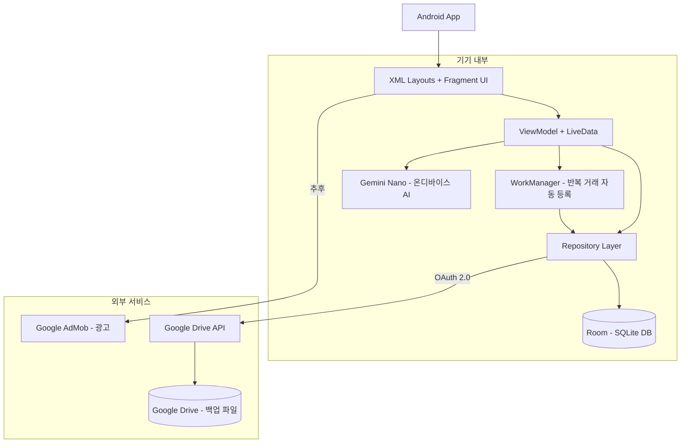
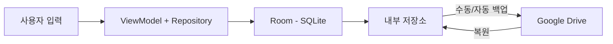
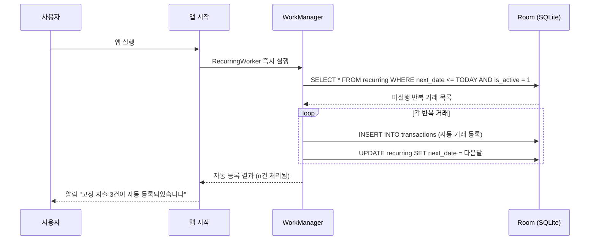
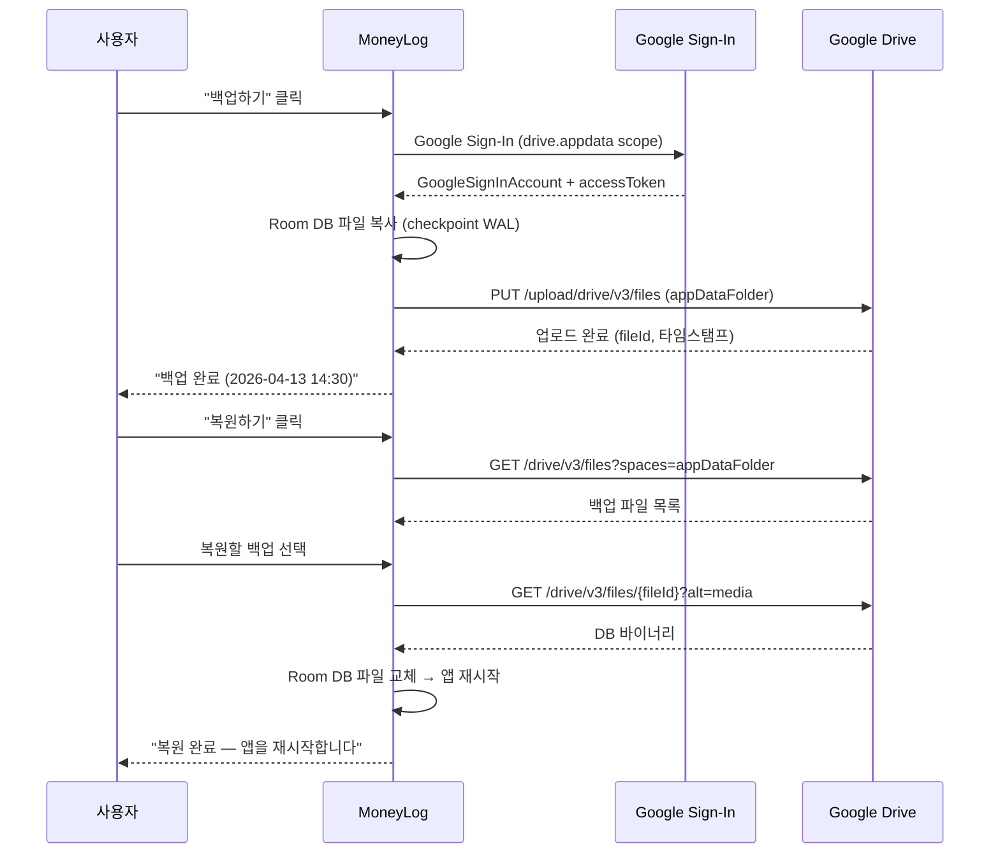
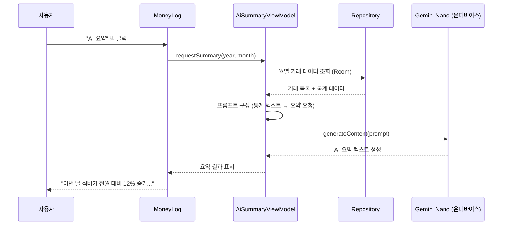

---
tags:
  - 아키텍처
  - 안드로이드
  - GeminiNano
관련:
  - "[[03_기술_스택]]"
  - "[[06_데이터_레이어_설계]]"
---

# 02. 시스템 아키텍처

> **최종 업데이트**: 2026-04-17 (Java 전환)

---

## 🗺️ 전체 아키텍처 다이어그램



---

## 🏛️ 아키텍처 선택: 안드로이드 네이티브 (로컬 퍼스트)

> [!info] 왜 안드로이드 네이티브인가?
>
> - **완전한 오프라인 동작**: 네트워크 없이 모든 기능 사용 가능
> - **Room(SQLite) 네이티브 지원**: 브라우저 WASM 없이 직접 SQLite 사용
> - **Gemini Nano 온디바이스 AI**: 인터넷 없이 소비 패턴 분석·요약
> - **프라이버시**: 사용자 재무 데이터가 외부 서버로 전송되지 않음
> - **순수 Java**: Kotlin 없이 Java 17 단독 사용 — 표준 Android 개발 환경
> - **WorkManager**: 앱이 꺼져 있어도 반복 거래를 예약·실행
> - **Google Drive 백업**: 기기 교체·초기화 시 복원 가능

---

## 💾 데이터 저장 전략



| 계층 | 기술 | 역할 |
|---|---|---|
| **SQL 엔진** | Room (SQLite) | Android 네이티브 SQL 쿼리 실행 |
| **영속 저장소** | 내부 저장소 (Internal Storage) | Room DB 파일 자동 저장 |
| **클라우드 백업** | Google Drive API v3 | `.db` 파일을 Google Drive appDataFolder에 업로드 |
| **설정 저장** | SharedPreferences | 앱 설정, 테마, 언어 등 경량 데이터 |
| **AI 추론** | Gemini Nano (AICore) | 온디바이스에서 소비 패턴 분석·요약 |

---

## 📦 프로젝트 구조 (MVVM + Clean Architecture)

```
moneylog/
├── app/
│   └── src/main/
│       ├── java/com/moneylog/
│       │   ├── data/
│       │   │   ├── db/
│       │   │   │   ├── AppDatabase.java              # Room DB (v4), 기본 카테고리 시드
│       │   │   │   ├── dao/
│       │   │   │   │   ├── TransactionDao.java
│       │   │   │   │   ├── CategoryDao.java
│       │   │   │   │   ├── RecurringDao.java
│       │   │   │   │   ├── MonthlySummary.java        # Room 프로젝션 POJO
│       │   │   │   │   ├── DailySummary.java          # Room 프로젝션 POJO
│       │   │   │   │   ├── CategorySummary.java       # Room 프로젝션 POJO
│       │   │   │   │   └── MonthlyTrend.java          # Room 프로젝션 POJO
│       │   │   │   └── entity/
│       │   │   │       ├── TransactionEntity.java
│       │   │   │       ├── CategoryEntity.java
│       │   │   │       └── RecurringEntity.java
│       │   │   ├── repository/
│       │   │   │   ├── TransactionRepository.java
│       │   │   │   ├── CategoryRepository.java
│       │   │   │   ├── RecurringRepository.java
│       │   │   │   ├── BackupRepository.java          # Google Drive 백업·복원
│       │   │   │   └── AiSummaryRepository.java       # Gemini Nano 분석, 로컬 폴백
│       │   │   └── worker/
│       │   │       └── RecurringWorker.java           # @HiltWorker, 매일 1회 실행
│       │   ├── ui/
│       │   │   ├── fragment/
│       │   │   │   ├── OnboardingFragment.java        # 언어 선택 (최초 실행)
│       │   │   │   ├── DashboardFragment.java
│       │   │   │   ├── TransactionFragment.java
│       │   │   │   ├── TransactionFormFragment.java
│       │   │   │   ├── StatisticsFragment.java
│       │   │   │   ├── AiSummaryFragment.java         # Gemini Nano AI 요약
│       │   │   │   ├── CategoryFragment.java          # 카테고리 관리
│       │   │   │   ├── RecurringFragment.java         # 반복 거래 관리
│       │   │   │   └── SettingsFragment.java          # 설정·데이터·백업
│       │   │   ├── adapter/
│       │   │   │   ├── TransactionAdapter.java        # 날짜 그룹 헤더 + 거래 아이템
│       │   │   │   ├── CategoryAdapter.java           # 카테고리 목록
│       │   │   │   ├── RecurringAdapter.java          # 반복 거래 목록
│       │   │   │   └── IconPickerAdapter.java         # 아이콘 선택 그리드
│       │   │   ├── viewmodel/
│       │   │   │   ├── TransactionViewModel.java      # @HiltViewModel, LiveData
│       │   │   │   ├── DashboardViewModel.java        # 월별 요약, 카테고리 지출
│       │   │   │   ├── StatisticsViewModel.java       # 월별 추이, 카테고리 분석
│       │   │   │   ├── RecurringViewModel.java        # 반복 거래 관리
│       │   │   │   ├── CategoryViewModel.java         # 카테고리 CRUD
│       │   │   │   └── AiSummaryViewModel.java        # Gemini Nano 분석
│       │   │   └── widget/
│       │   │       └── PieChartView.java              # 커스텀 파이 차트 View
│       │   ├── di/
│       │   │   └── AppModule.java                     # Hilt @Module, DB + DAO Provides
│       │   ├── util/
│       │   │   ├── DateUtils.java                     # java.time.LocalDate, YearMonth (Desugared)
│       │   │   ├── FormatUtils.java                   # DecimalFormat 금액 포맷 (텍스트 모드 포함)
│       │   │   ├── LocaleHelper.java                  # ko/en/ja 언어 전환
│       │   │   ├── IconHelper.java                    # Material Icons 매핑
│       │   │   ├── DataManagementHelper.java          # CSV 내보내기/가져오기, 데이터 정리
│       │   │   └── YearMonthPickerDialog.java         # 년/월 선택 다이얼로그
│       │   ├── MainActivity.java
│       │   └── MoneyLogApplication.java
│       ├── res/
│       │   ├── layout/
│       │   │   ├── activity_main.xml                  # FragmentContainerView + BottomNavigationView
│       │   │   ├── fragment_onboarding.xml
│       │   │   ├── fragment_dashboard.xml
│       │   │   ├── fragment_transaction.xml
│       │   │   ├── fragment_transaction_form.xml
│       │   │   ├── fragment_statistics.xml
│       │   │   ├── fragment_ai_summary.xml
│       │   │   ├── fragment_category.xml
│       │   │   ├── fragment_settings.xml
│       │   │   ├── bottom_sheet_category.xml
│       │   │   ├── dialog_year_month_picker.xml
│       │   │   ├── item_transaction.xml
│       │   │   ├── item_transaction_header.xml
│       │   │   ├── item_dashboard_transaction.xml
│       │   │   ├── item_category.xml
│       │   │   ├── item_category_bar.xml
│       │   │   ├── item_statistics_category.xml
│       │   │   └── item_icon_picker.xml
│       │   ├── navigation/
│       │   │   └── nav_graph.xml
│       │   ├── menu/
│       │   │   └── bottom_nav_menu.xml
│       │   ├── color/
│       │   │   └── bottom_nav_selector.xml
│       │   ├── drawable/
│       │   │   ├── ic_*.xml                           # 벡터 아이콘 (ic_cat_* 포함, 25+종)
│       │   │   └── bg_*.xml                           # 배경 shape drawable
│       │   ├── font/
│       │   │   ├── pretendard_*.ttf                   # Pretendard (regular/medium/semibold/bold)
│       │   │   └── manrope_*.ttf                      # Manrope (semibold/bold/extrabold)
│       │   ├── values/
│       │   │   ├── colors.xml                         # Material 3 브랜드 컬러
│       │   │   ├── strings.xml
│       │   │   └── themes.xml                         # Theme.Material3.DayNight.NoActionBar
│       │   ├── values-en/
│       │   │   └── strings.xml                        # 영어 문자열
│       │   ├── values-ja/
│       │   │   └── strings.xml                        # 일본어 문자열
│       │   └── xml/
│       │       ├── backup_rules.xml
│       │       ├── data_extraction_rules.xml
│       │       └── locales_config.xml                 # ko, en, ja 지원
│       └── AndroidManifest.xml
├── build.gradle.kts
├── gradle/libs.versions.toml
└── README.md
```

---

## ⏰ 반복 거래 자동화 흐름



> [!note] WorkManager 활용
> Android WorkManager를 통해 앱 실행 시 즉시 실행 + 매일 1회 주기적 실행을 등록한다.
> 앱을 오래 열지 않아도 기기가 켜져 있으면 백그라운드에서 자동 처리.

---

## ☁️ Google Drive 백업 흐름



> [!warning] appDataFolder
> Google Drive의 `appDataFolder`는 앱 전용 숨김 폴더로, 사용자의 드라이브 용량을 차지하지 않으며 다른 앱에서 접근할 수 없다.

---

## 🤖 Gemini Nano AI 요약 흐름



> [!info] Gemini Nano 가용성
>
> - **지원 기기**: Pixel 8 Pro+, Pixel 9 시리즈, Samsung Galaxy S24+, 기타 AICore 탑재 기기
> - **폴백**: Gemini Nano 미지원 기기에서는 AI 요약 대신 **기본 통계 텍스트**를 보여줌
> - **인터넷 불필요**: 완전히 온디바이스에서 추론 → 재무 데이터가 외부로 전송되지 않음

### AI 요약 활용 시나리오

| 기능 | 프롬프트 예시 | 출력 예시 |
|---|---|---|
| **월간 소비 요약** | "다음 데이터를 바탕으로 이번 달 소비 패턴을 2~3문장으로 요약..." | "4월 총 지출 82만원 중 식비가 45%로 가장 큰 비중입니다. 전월 대비 카페 지출이 30% 증가했습니다." |
| **절약 조언** | "아래 소비 데이터에서 줄일 수 있는 항목을 제안..." | "카페/간식 지출이 월 6만원으로 예산의 92%를 사용했습니다. 커피를 주 3회로 줄이면 월 2만원 절약 가능합니다." |
| **카테고리 자동 추천** | "메모: '스타벅스 아이스 아메리카노' → 카테고리 추천" | "카페/간식" |

---

## 📢 광고 통합 구조 (추후)

```
┌─────────────────────────┐
│   TopAppBar              │
├─────────────────────────┤
│                          │
│     메인 콘텐츠 영역      │
│                          │
├─────────────────────────┤
│   AdBanner (320x50)      │  ← Google AdMob 배너
├─────────────────────────┤
│   Bottom Navigation      │
└─────────────────────────┘
```

| 항목 | 설명 |
|---|---|
| 광고 SDK | Google AdMob (Android) |
| 광고 위치 | Bottom Navigation 위 배너 (320x50) |
| 전면 광고 | 통계 페이지 진입 시 인터스티셜 (선택) |
| 비활성 조건 | MVP 기간 동안 `AD_ENABLED=false` |
| 구현 시점 | Phase 7 (P2) |

---

## 연관 문서

- [[01_프로젝트_개요]] — 프로젝트 목표
- [[03_기술_스택]] — 상세 기술 스택
- [[06_데이터_레이어_설계]] — Repository + DAO 기반 데이터 레이어
