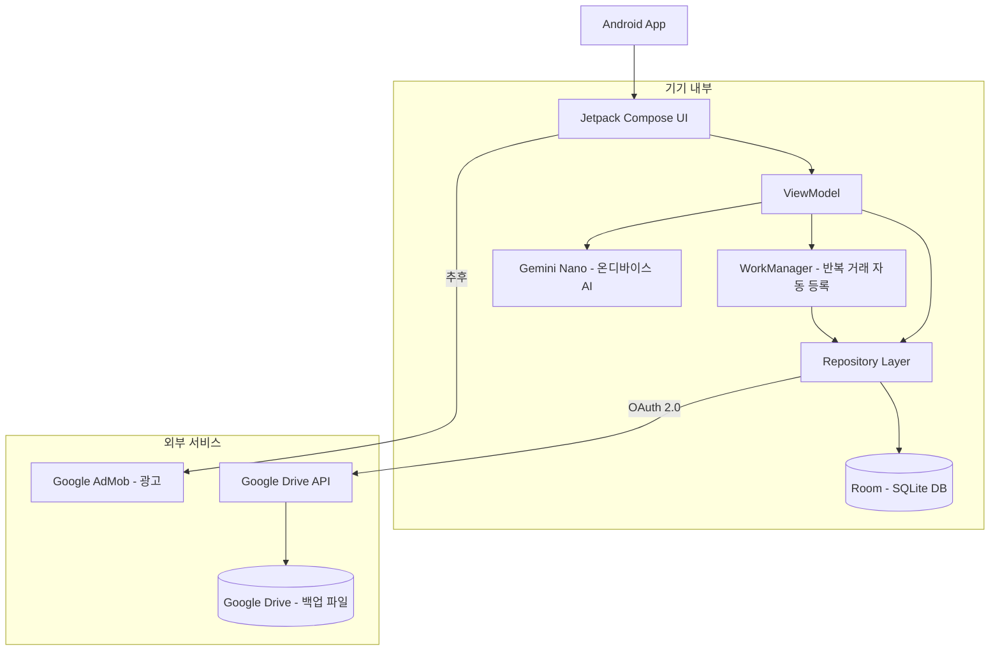
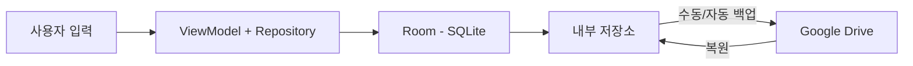
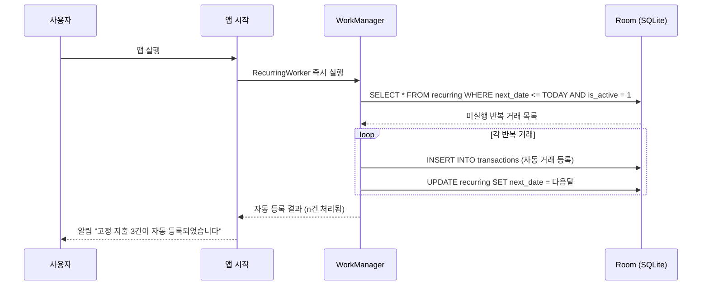
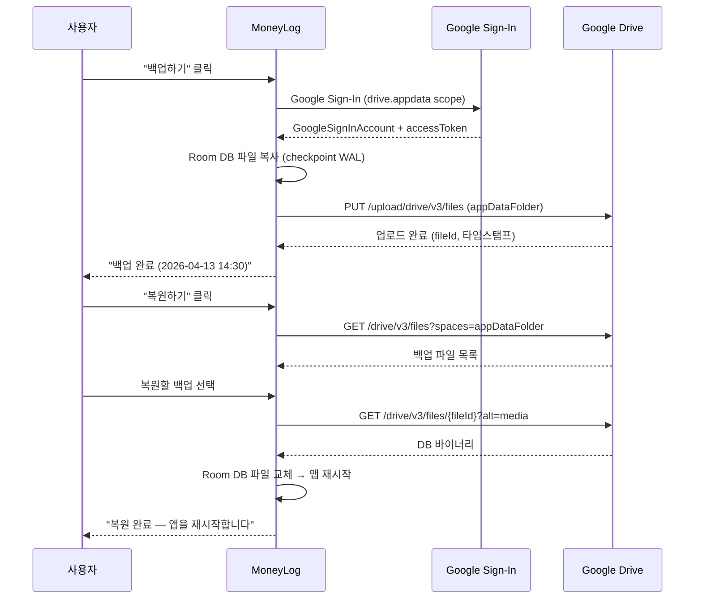
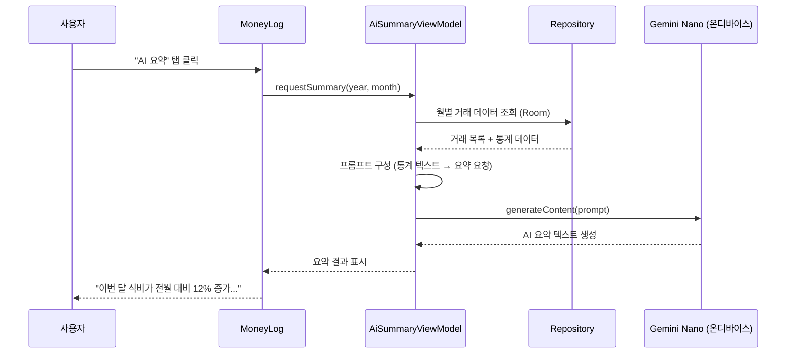

---
tags:
  - 아키텍처
  - 안드로이드
  - GeminiNano
관련:
  - "[[03_기술_스택]]"
  - "[[06_데이터_레이어_설계]]"
---

# 02. 시스템 아키텍처

> **최종 업데이트**: 2026-04

---

## 🗺️ 전체 아키텍처 다이어그램



---

## 🏛️ 아키텍처 선택: 안드로이드 네이티브 (로컬 퍼스트)

> [!info] 왜 안드로이드 네이티브인가?

> - **완전한 오프라인 동작**: 네트워크 없이 모든 기능 사용 가능
> - **Room(SQLite) 네이티브 지원**: 브라우저 WASM 없이 직접 SQLite 사용
> - **Gemini Nano 온디바이스 AI**: 인터넷 없이 소비 패턴 분석·요약
> - **프라이버시**: 사용자 재무 데이터가 외부 서버로 전송되지 않음
> - **네이티브 성능**: Jetpack Compose의 부드러운 UI 경험
> - **WorkManager**: 앱이 꺼져 있어도 반복 거래를 예약·실행
> - **Google Drive 백업**: 기기 교체·초기화 시 복원 가능

---

## 💾 데이터 저장 전략



| 계층 | 기술 | 역할 |
|---|---|---|
| **SQL 엔진** | Room (SQLite) | Android 네이티브 SQL 쿼리 실행 |
| **영속 저장소** | 내부 저장소 (Internal Storage) | Room DB 파일 자동 저장 |
| **클라우드 백업** | Google Drive API v3 | `.db` 파일을 Google Drive appDataFolder에 업로드 |
| **설정 저장** | EncryptedSharedPreferences | 앱 설정, 테마, PIN 해시 등 경량 데이터 (암호화) |
| **AI 추론** | Gemini Nano (AICore) | 온디바이스에서 소비 패턴 분석·요약 |

---

## 📦 프로젝트 구조 (MVVM + Clean Architecture)

```
moneylog/
├── app/
│   └── src/main/
│       ├── java/com/moneylog/
│       │   ├── data/
│       │   │   ├── db/
│       │   │   │   ├── AppDatabase.kt          # Room Database
│       │   │   │   ├── dao/
│       │   │   │   │   ├── TransactionDao.kt
│       │   │   │   │   ├── CategoryDao.kt
│       │   │   │   │   ├── BudgetDao.kt
│       │   │   │   │   └── RecurringDao.kt
│       │   │   │   └── entity/
│       │   │   │       ├── TransactionEntity.kt
│       │   │   │       ├── CategoryEntity.kt
│       │   │   │       ├── BudgetEntity.kt
│       │   │   │       └── RecurringEntity.kt
│       │   │   ├── repository/
│       │   │   │   ├── TransactionRepository.kt
│       │   │   │   ├── CategoryRepository.kt
│       │   │   │   ├── BudgetRepository.kt
│       │   │   │   ├── RecurringRepository.kt
│       │   │   │   ├── BackupRepository.kt      # Google Drive
│       │   │   │   └── AiSummaryRepository.kt   # Gemini Nano
│       │   │   └── worker/
│       │   │       └── RecurringWorker.kt        # WorkManager
│       │   ├── ui/
│       │   │   ├── screen/
│       │   │   │   ├── DashboardScreen.kt
│       │   │   │   ├── TransactionScreen.kt
│       │   │   │   ├── TransactionFormScreen.kt
│       │   │   │   ├── RecurringScreen.kt
│       │   │   │   ├── StatisticsScreen.kt
│       │   │   │   ├── BudgetScreen.kt
│       │   │   │   ├── SettingsScreen.kt
│       │   │   │   ├── PinLockScreen.kt
│       │   │   │   └── AiSummaryScreen.kt        # AI 요약
│       │   │   ├── viewmodel/
│       │   │   │   ├── DashboardViewModel.kt
│       │   │   │   ├── TransactionViewModel.kt
│       │   │   │   ├── RecurringViewModel.kt
│       │   │   │   ├── StatisticsViewModel.kt
│       │   │   │   ├── BudgetViewModel.kt
│       │   │   │   ├── SettingsViewModel.kt
│       │   │   │   └── AiSummaryViewModel.kt
│       │   │   ├── component/
│       │   │   │   ├── TransactionForm.kt
│       │   │   │   ├── TransactionList.kt
│       │   │   │   ├── CategoryBadge.kt
│       │   │   │   ├── MonthlyChart.kt
│       │   │   │   ├── BudgetProgress.kt
│       │   │   │   ├── RecurringList.kt
│       │   │   │   ├── AiSummaryCard.kt          # AI 요약 카드
│       │   │   │   └── AdBanner.kt                # 광고 (추후)
│       │   │   ├── navigation/
│       │   │   │   └── NavGraph.kt
│       │   │   └── theme/
│       │   │       ├── Theme.kt
│       │   │       ├── Color.kt
│       │   │       └── Type.kt
│       │   ├── di/
│       │   │   └── AppModule.kt                   # Hilt DI
│       │   └── util/
│       │       ├── DateUtils.kt
│       │       └── CryptoUtils.kt                 # PIN 해시
│       ├── res/
│       └── AndroidManifest.xml
├── build.gradle.kts
├── gradle/libs.versions.toml
└── README.md
```

---

## ⏰ 반복 거래 자동화 흐름



> [!note] WorkManager 활용
> Android WorkManager를 통해 앱 실행 시 즉시 실행 + 매일 1회 주기적 실행을 등록한다.
> 앱을 오래 열지 않아도 기기가 켜져 있으면 백그라운드에서 자동 처리.

---

## ☁️ Google Drive 백업 흐름



> [!warning] appDataFolder
> Google Drive의 `appDataFolder`는 앱 전용 숨김 폴더로, 사용자의 드라이브 용량을 차지하지 않으며 다른 앱에서 접근할 수 없다.

---

## 🤖 Gemini Nano AI 요약 흐름



> [!info] Gemini Nano 가용성
> - **지원 기기**: Pixel 8 Pro+, Pixel 9 시리즈, Samsung Galaxy S24+, 기타 AICore 탑재 기기
> - **폴백**: Gemini Nano 미지원 기기에서는 AI 요약 대신 **기본 통계 텍스트**를 보여줌
> - **인터넷 불필요**: 완전히 온디바이스에서 추론 → 재무 데이터가 외부로 전송되지 않음

### AI 요약 활용 시나리오

| 기능 | 프롬프트 예시 | 출력 예시 |
|---|---|---|
| **월간 소비 요약** | "다음 데이터를 바탕으로 이번 달 소비 패턴을 2~3문장으로 요약..." | "4월 총 지출 82만원 중 식비가 45%로 가장 큰 비중입니다. 전월 대비 카페 지출이 30% 증가했습니다." |
| **절약 조언** | "아래 소비 데이터에서 줄일 수 있는 항목을 제안..." | "카페/간식 지출이 월 6만원으로 예산의 92%를 사용했습니다. 커피를 주 3회로 줄이면 월 2만원 절약 가능합니다." |
| **카테고리 자동 추천** | "메모: '스타벅스 아이스 아메리카노' → 카테고리 추천" | "카페/간식" |

---

## 📢 광고 통합 구조 (추후)

```
┌─────────────────────────┐
│   TopAppBar              │
├─────────────────────────┤
│                          │
│     메인 콘텐츠 영역      │
│                          │
├─────────────────────────┤
│   AdBanner (320x50)      │  ← Google AdMob 배너
├─────────────────────────┤
│   Bottom Navigation      │
└─────────────────────────┘
```

| 항목 | 설명 |
|---|---|
| 광고 SDK | Google AdMob (Android) |
| 광고 위치 | Bottom Navigation 위 배너 (320x50) |
| 전면 광고 | 통계 페이지 진입 시 인터스티셜 (선택) |
| 비활성 조건 | MVP 기간 동안 `AD_ENABLED=false` |
| 구현 시점 | Phase 7 (P2) |

---

## 🔐 로컬 인증 (PIN + 생체인증)

서버 기반 JWT 인증 대신, **로컬 PIN + 생체인증(지문)**으로 프라이버시를 보호한다.

| 항목 | 설명 |
|---|---|
| 저장 위치 | `EncryptedSharedPreferences` (PIN의 SHA-256 해시 + Android Keystore) |
| 잠금 시점 | 앱 실행 시, 백그라운드 복귀 시 (5분 이상) |
| PIN 형식 | 4~6자리 숫자 |
| 생체인증 | AndroidX Biometric API (지문/얼굴) — PIN 대체 |
| 실패 제한 | 5회 연속 실패 → 30초 대기 |

---

## 🔗 연관 문서

- [[01_프로젝트_개요]] — 프로젝트 목표
- [[03_기술_스택]] — 상세 기술 스택
- [[06_데이터_레이어_설계]] — Repository + DAO 기반 데이터 레이어
