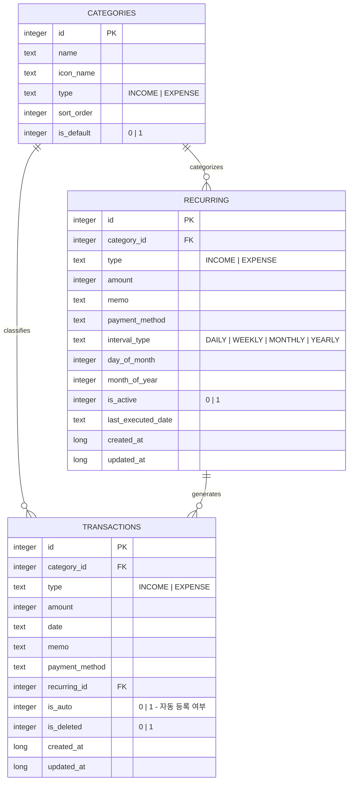

---
tags:
  - DB
  - ERD
  - Room
관련:
  - "[[04_기능_요구사항]]"
  - "[[06_데이터_레이어_설계]]"
---

# 05. 데이터베이스 설계

> **최종 업데이트**: 2026-04

> [!info] Room (Android SQLite ORM)
> Android Room 라이브러리를 통해 SQLite 데이터베이스를 관리한다.
> Entity → DAO → Database 구조로 컴파일 타임 SQL 검증이 가능하며, Flow를 통해 UI가 실시간 반응한다.
> Google Drive로 `.db` 파일 백업·복원이 가능하다.

---

## 🗺️ ERD (Entity Relationship Diagram)



> [!note] 단일 사용자 / budgets 테이블 제거
> 로컬 앱이므로 `users` 테이블과 `user_id` FK가 불필요하다.
> **budgets 테이블은 DB v2→v3 마이그레이션에서 제거되었다.** (예산 관리 기능은 추후 재구현 예정)

---

## 📋 테이블 상세 정의

### categories

| 컬럼 | 타입 | 제약 | 설명 |
|---|---|---|---|
| `id` | `INTEGER` | PK, AUTOINCREMENT | 카테고리 ID |
| `name` | `TEXT` | NOT NULL | 카테고리 이름 |
| `icon_name` | `TEXT` | NOT NULL | Material Icon 이름 (IconHelper 매핑) |
| `type` | `TEXT` | NOT NULL, CHECK IN ('INCOME','EXPENSE') | 유형 |
| `sort_order` | `INTEGER` | NOT NULL, DEFAULT 0 | 정렬 순서 |
| `is_default` | `INTEGER` | NOT NULL, DEFAULT 0 | 기본 카테고리 여부 (0/1) |

### transactions

| 컬럼 | 타입 | 제약 | 설명 |
|---|---|---|---|
| `id` | `INTEGER` | PK, AUTOINCREMENT | 거래 ID |
| `category_id` | `INTEGER` | FK → categories.id, NOT NULL | 카테고리 |
| `type` | `TEXT` | NOT NULL, CHECK IN ('INCOME','EXPENSE') | 유형 |
| `amount` | `INTEGER` | NOT NULL, CHECK > 0 | 금액 (원 단위) |
| `date` | `TEXT` | NOT NULL | 거래 발생일 (yyyy-MM-dd) |
| `memo` | `TEXT` | - | 메모 |
| `payment_method` | `TEXT` | - | `CASH` / `CARD` / `TRANSFER` / `OTHER` |
| `recurring_id` | `INTEGER` | FK → recurring.id | 반복 거래 참조 (NULL이면 일반 거래) |
| `is_auto` | `INTEGER` | NOT NULL, DEFAULT 0 | 반복 거래 자동 등록 여부 |
| `is_deleted` | `INTEGER` | NOT NULL, DEFAULT 0 | 소프트 삭제 |
| `created_at` | `INTEGER` | NOT NULL | 등록일시 (epoch ms) |
| `updated_at` | `INTEGER` | NOT NULL | 수정일시 (epoch ms) |

> [!tip] 인덱스 설계
> ```sql
> CREATE INDEX idx_tx_date ON transactions(transaction_date);
> CREATE INDEX idx_tx_category ON transactions(category_id);
> CREATE INDEX idx_tx_type ON transactions(type);
> CREATE INDEX idx_tx_deleted ON transactions(is_deleted);
> ```

### budgets

| 컬럼 | 타입 | 제약 | 설명 |
|---|---|---|---|
| `id` | `INTEGER` | PK, AUTOINCREMENT | 예산 ID |
| `category_id` | `INTEGER` | FK → categories.id | 카테고리 (NULL = 전체 예산) |
| `amount` | `INTEGER` | NOT NULL, CHECK > 0 | 예산 금액 |
| `year` | `INTEGER` | NOT NULL | 연도 |
| `month` | `INTEGER` | NOT NULL, CHECK BETWEEN 1 AND 12 | 월 |
| `created_at` | `TEXT` | NOT NULL, DEFAULT (datetime('now','localtime')) | 생성일시 |
| `updated_at` | `TEXT` | NOT NULL, DEFAULT (datetime('now','localtime')) | 수정일시 |

> [!note] 유니크 제약
> ```sql
> CREATE UNIQUE INDEX uq_budget_category_month 
>     ON budgets(category_id, year, month);
> ```

### recurring_transactions

| 컬럼 | 타입 | 제약 | 설명 |
|---|---|---|---|
| `id` | `INTEGER` | PK, AUTOINCREMENT | 반복 거래 ID |
| `category_id` | `INTEGER` | FK → categories.id, NOT NULL | 카테고리 |
| `type` | `TEXT` | NOT NULL, CHECK IN ('INCOME','EXPENSE') | 유형 |
| `amount` | `INTEGER` | NOT NULL, CHECK > 0 | 금액 |
| `memo` | `TEXT` | - | 메모 |
| `payment_method` | `TEXT` | - | 결제 수단 |
| `day_of_month` | `INTEGER` | NOT NULL, CHECK BETWEEN 1 AND 31 | 매월 실행일 |
| `is_active` | `INTEGER` | NOT NULL, DEFAULT 1 | 활성 여부 (0/1) |
| `next_execution_date` | `TEXT` | NOT NULL | 다음 실행일 (yyyy-MM-dd) |
| `created_at` | `TEXT` | NOT NULL, DEFAULT (datetime('now','localtime')) | 생성일시 |

---

## 🔄 스키마 마이그레이션

Room의 **Auto Migration + 수동 Migration**으로 스키마 버전을 관리한다.

| 버전 | 변경 내용 |
|---|---|
| **v1** | 초기 스키마 (categories, transactions, recurring, budgets) |
| **v1 → v2** | recurring 테이블에 `interval_type` 컨럼 추가 (DAILY/WEEKLY/MONTHLY/YEARLY) |
| **v2 → v3** | budgets 테이블 제거 (예산 관리 기능 일시 보류) |

```java
// data/db/AppDatabase.java
@Database(
    entities = {
        CategoryEntity.class,
        TransactionEntity.class,
        RecurringEntity.class
    },
    version = 3,
    autoMigrations = {
        @AutoMigration(from = 1, to = 2)   // interval_type 컨럼 추가
    }
)
public abstract class AppDatabase extends RoomDatabase {
    public abstract TransactionDao transactionDao();
    public abstract CategoryDao categoryDao();
    public abstract RecurringDao recurringDao();

    // v2 → v3: budgets 테이블 DROP (수동 마이그레이션)
    static final Migration MIGRATION_2_3 = new Migration(2, 3) {
        @Override
        public void migrate(@NonNull SupportSQLiteDatabase database) {
            database.execSQL("DROP TABLE IF EXISTS budgets");
        }
    };
}
```

---

## 💾 초기 데이터 (기본 카테고리)

```sql
-- 지출 카테고리
INSERT INTO categories (name, icon_name, type, sort_order, is_default) VALUES
  ('식비', 'ic_cat_restaurant', 'EXPENSE', 1, 1),
  ('교통', 'ic_cat_directions_bus', 'EXPENSE', 2, 1),
  ('주거/통신', 'ic_cat_home', 'EXPENSE', 3, 1),
  ('문화/여가', 'ic_cat_sports_esports', 'EXPENSE', 4, 1),
  ('의류/미용', 'ic_cat_checkroom', 'EXPENSE', 5, 1),
  ('의료/건강', 'ic_cat_local_hospital', 'EXPENSE', 6, 1),
  ('교육', 'ic_cat_school', 'EXPENSE', 7, 1),
  ('경조/선물', 'ic_cat_redeem', 'EXPENSE', 8, 1),
  ('카페/간식', 'ic_cat_local_cafe', 'EXPENSE', 9, 1),
  ('기타', 'ic_cat_category', 'EXPENSE', 10, 1);

-- 수입 카테고리
INSERT INTO categories (name, icon_name, type, sort_order, is_default) VALUES
  ('급여', 'ic_cat_payments', 'INCOME', 1, 1),
  ('부수입', 'ic_cat_attach_money', 'INCOME', 2, 1),
  ('용돈', 'ic_cat_person', 'INCOME', 3, 1),
  ('투자수익', 'ic_cat_trending_up', 'INCOME', 4, 1),
  ('기타수입', 'ic_cat_account_balance_wallet', 'INCOME', 5, 1);
```

---

## 🔗 연관 문서

- [[04_기능_요구사항]] — 기능 명세
- [[06_데이터_레이어_설계]] — Repository + DAO 기반 데이터 접근

### 스택: #DB #ERD #Room #SQLite
