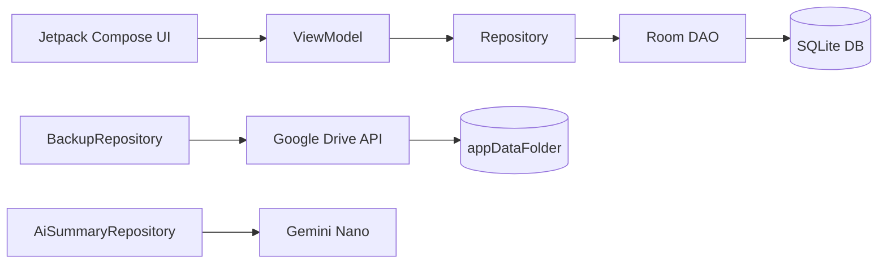

---
tags:
  - 데이터레이어
  - Repository
  - Room
  - GeminiNano
관련:
  - "[[05_데이터베이스_설계]]"
  - "[[04_기능_요구사항]]"
---

# 06. 데이터 레이어 설계

> **최종 업데이트**: 2026-04

> [!info] Repository + DAO 패턴
> REST API 대신, **Repository → DAO → Room** 구조로 데이터를 관리한다.
> ViewModel이 Repository를 호출하고, Repository가 DAO를 통해 SQLite에 접근한다.
> Kotlin Flow로 데이터 변경 시 UI가 자동 업데이트된다.

---

## 🗺️ 데이터 흐름



---

## 🔧 핵심 DAO 상세

### `TransactionDao` — 거래 CRUD

```kotlin
@Dao
interface TransactionDao {
    @Query("""
        SELECT t.*, c.name AS categoryName, c.icon, c.color
        FROM transactions t
        JOIN categories c ON t.category_id = c.id
        WHERE t.transaction_date BETWEEN :startDate AND :endDate
          AND t.is_deleted = 0
        ORDER BY t.transaction_date DESC, t.created_at DESC
    """)
    fun getByDateRange(startDate: String, endDate: String): Flow<List<TransactionWithCategory>>

    @Query("""
        SELECT 
          SUM(CASE WHEN type = 'INCOME' THEN amount ELSE 0 END) AS totalIncome,
          SUM(CASE WHEN type = 'EXPENSE' THEN amount ELSE 0 END) AS totalExpense,
          COUNT(*) AS transactionCount
        FROM transactions
        WHERE transaction_date BETWEEN :startDate AND :endDate
          AND is_deleted = 0
    """)
    fun getMonthlySummary(startDate: String, endDate: String): Flow<MonthlySummary>

    @Query("""
        SELECT c.id, c.name, c.icon, c.color,
          SUM(t.amount) AS total
        FROM transactions t
        JOIN categories c ON t.category_id = c.id
        WHERE t.type = 'EXPENSE' AND t.is_deleted = 0
          AND t.transaction_date BETWEEN :startDate AND :endDate
        GROUP BY c.id
        ORDER BY total DESC
    """)
    fun getCategoryBreakdown(startDate: String, endDate: String): Flow<List<CategoryBreakdown>>

    @Insert
    suspend fun insert(transaction: TransactionEntity): Long

    @Update
    suspend fun update(transaction: TransactionEntity)

    @Query("UPDATE transactions SET is_deleted = 1, updated_at = :now WHERE id = :id")
    suspend fun softDelete(id: Long, now: String)
}
```

---

### `RecurringDao` — 반복 거래

```kotlin
@Dao
interface RecurringDao {
    @Query("SELECT * FROM recurring_transactions WHERE is_active = 1")
    fun getActive(): Flow<List<RecurringEntity>>

    @Query("""
        SELECT * FROM recurring_transactions 
        WHERE is_active = 1 AND next_execution_date <= :today
    """)
    suspend fun getPending(today: String): List<RecurringEntity>

    @Insert
    suspend fun insert(recurring: RecurringEntity): Long

    @Update
    suspend fun update(recurring: RecurringEntity)

    @Query("UPDATE recurring_transactions SET is_active = :active WHERE id = :id")
    suspend fun setActive(id: Long, active: Boolean)
}
```

---

## 🏗️ Repository 상세

### `TransactionRepository`

```kotlin
class TransactionRepository @Inject constructor(
    private val transactionDao: TransactionDao
) {
    fun getByMonth(year: Int, month: Int): Flow<List<TransactionWithCategory>> {
        val start = "$year-${month.toString().padStart(2, '0')}-01"
        val end = "$year-${month.toString().padStart(2, '0')}-31"
        return transactionDao.getByDateRange(start, end)
    }
    
    fun getMonthlySummary(year: Int, month: Int): Flow<MonthlySummary> { ... }
    suspend fun create(input: CreateTransactionInput): Long { ... }
    suspend fun update(id: Long, input: UpdateTransactionInput) { ... }
    suspend fun softDelete(id: Long) { ... }
}
```

---

### `RecurringRepository` — 자동 실행 로직

```kotlin
class RecurringRepository @Inject constructor(
    private val recurringDao: RecurringDao,
    private val transactionDao: TransactionDao
) {
    suspend fun checkAndExecutePending(): Int {
        val today = LocalDate.now().toString()  // "yyyy-MM-dd"
        val pending = recurringDao.getPending(today)
        var executedCount = 0
        
        for (recurring in pending) {
            var nextDate = LocalDate.parse(recurring.nextExecutionDate)
            val todayDate = LocalDate.now()
            
            // 밀린 달 모두 처리
            while (!nextDate.isAfter(todayDate)) {
                transactionDao.insert(
                    TransactionEntity(
                        categoryId = recurring.categoryId,
                        type = recurring.type,
                        amount = recurring.amount,
                        transactionDate = nextDate.toString(),
                        memo = recurring.memo,
                        paymentMethod = recurring.paymentMethod,
                        isAuto = true
                    )
                )
                executedCount++
                nextDate = nextDate.plusMonths(1)
            }
            
            recurringDao.update(recurring.copy(nextExecutionDate = nextDate.toString()))
        }
        return executedCount
    }
}
```

---

### `BackupRepository` — Google Drive 백업·복원

```kotlin
class BackupRepository @Inject constructor(
    @ApplicationContext private val context: Context,
    private val db: AppDatabase
) {
    suspend fun backup(driveService: Drive): BackupInfo {
        // WAL checkpoint → DB 파일 복사
        db.query("PRAGMA wal_checkpoint(FULL)", null)
        val dbFile = context.getDatabasePath("moneylog.db")
        
        val timestamp = LocalDateTime.now()
            .format(DateTimeFormatter.ofPattern("yyyy-MM-dd_HHmmss"))
        val metadata = File().apply {
            name = "moneylog_$timestamp.db"
            parents = listOf("appDataFolder")
        }
        
        val content = FileContent("application/octet-stream", dbFile)
        val uploaded = driveService.files().create(metadata, content)
            .setFields("id,name,createdTime,size")
            .execute()
        
        return BackupInfo(uploaded.id, uploaded.name, uploaded.createdTime.toString())
    }
    
    suspend fun restore(driveService: Drive, fileId: String) {
        val outputStream = ByteArrayOutputStream()
        driveService.files().get(fileId).executeMediaAndDownloadTo(outputStream)
        
        db.close()
        val dbFile = context.getDatabasePath("moneylog.db")
        dbFile.writeBytes(outputStream.toByteArray())
        // 앱 프로세스 재시작
    }
    
    suspend fun listBackups(driveService: Drive): List<BackupFile> {
        val result = driveService.files().list()
            .setSpaces("appDataFolder")
            .setFields("files(id,name,createdTime,size)")
            .setOrderBy("createdTime desc")
            .execute()
        return result.files.map { BackupFile(it.id, it.name, it.size, it.createdTime.toString()) }
    }
}
```

---

### `AiSummaryRepository` — Gemini Nano AI 요약

```kotlin
class AiSummaryRepository @Inject constructor(
    private val transactionDao: TransactionDao
) {
    private var generativeModel: GenerativeModel? = null
    
    /** Gemini Nano 사용 가능 여부 확인 */
    suspend fun isAvailable(): Boolean {
        return try {
            val model = GenerativeModel.newBuilder()
                .setModelName("gemini-nano")
                .build()
            generativeModel = model
            true
        } catch (e: Exception) {
            false
        }
    }
    
    /** 월간 소비 요약 생성 */
    suspend fun generateMonthlySummary(year: Int, month: Int): String {
        val model = generativeModel ?: return "AI 요약을 사용할 수 없습니다."
        
        // 통계 데이터 수집
        val summary = transactionDao.getMonthlySummarySync(
            "$year-${month.toString().padStart(2, '0')}-01",
            "$year-${month.toString().padStart(2, '0')}-31"
        )
        val breakdown = transactionDao.getCategoryBreakdownSync(
            "$year-${month.toString().padStart(2, '0')}-01",
            "$year-${month.toString().padStart(2, '0')}-31"
        )
        
        val prompt = buildString {
            appendLine("다음은 ${year}년 ${month}월 가계부 데이터입니다.")
            appendLine("총 수입: ${summary.totalIncome}원")
            appendLine("총 지출: ${summary.totalExpense}원")
            appendLine("카테고리별 지출:")
            breakdown.forEach {
                appendLine("- ${it.name}: ${it.total}원")
            }
            appendLine()
            appendLine("위 데이터를 바탕으로 이번 달 소비 패턴을 2~3문장으로 요약하고,")
            appendLine("절약할 수 있는 항목이 있다면 간단히 제안해주세요.")
        }
        
        val response = model.generateContent(prompt)
        return response.text ?: "요약을 생성할 수 없습니다."
    }
    
    /** 카테고리 자동 추천 */
    suspend fun suggestCategory(memo: String, categories: List<String>): String? {
        val model = generativeModel ?: return null
        
        val prompt = "거래 메모: '$memo'\n" +
            "카테고리 목록: ${categories.joinToString(", ")}\n" +
            "위 메모에 가장 적합한 카테고리 이름 하나만 답하세요."
        
        val response = model.generateContent(prompt)
        return response.text?.trim()
    }
}
```

> [!warning] Gemini Nano 폴백
> `isAvailable()`이 `false`면 AI 관련 UI를 숨기고, 수치 기반 통계(F06)만 표시한다.

---

### `AppLockRepository` — PIN + 생체인증

```kotlin
class AppLockRepository @Inject constructor(
    @ApplicationContext private val context: Context
) {
    private val prefs = EncryptedSharedPreferences.create(
        context, "app_lock",
        MasterKey.Builder(context).setKeyScheme(MasterKey.KeyScheme.AES256_GCM).build(),
        EncryptedSharedPreferences.PrefKeyEncryptionScheme.AES256_SIV,
        EncryptedSharedPreferences.PrefValueEncryptionScheme.AES256_GCM
    )
    
    fun isSetup(): Boolean = prefs.contains("pin_hash")
    
    fun setupPin(pin: String) {
        prefs.edit().putString("pin_hash", sha256(pin)).apply()
    }
    
    fun verifyPin(pin: String): Boolean {
        return prefs.getString("pin_hash", null) == sha256(pin)
    }
    
    private fun sha256(input: String): String {
        val digest = MessageDigest.getInstance("SHA-256")
        return digest.digest(input.toByteArray()).joinToString("") { "%02x".format(it) }
    }
}
```

---

## 🔗 연관 문서

- [[05_데이터베이스_설계]] — DB 스키마
- [[04_기능_요구사항]] — 기능 명세
- [[02_시스템_아키텍처]] — 전체 아키텍처

### 스택: #데이터레이어 #Repository #Room #GeminiNano #GoogleDrive
