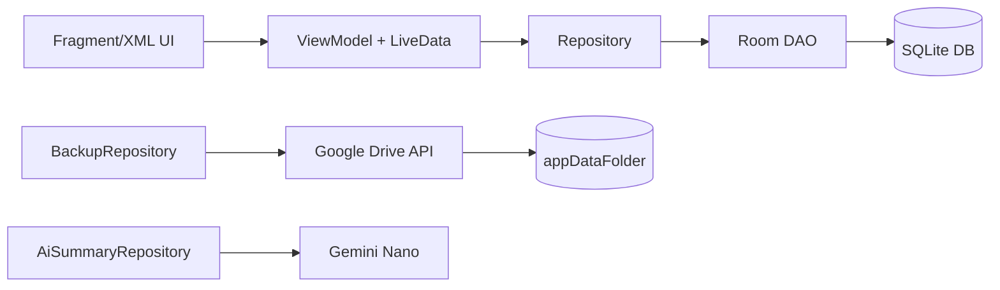

---
tags:
  - 데이터레이어
  - Repository
  - Room
  - GeminiNano
관련:
  - "[[05_데이터베이스_설계]]"
  - "[[04_기능_요구사항]]"
---

# 06. 데이터 레이어 설계

> **최종 업데이트**: 2026-04-17 (Java 전환)
>
> [!info] Repository + DAO 패턴 (Java)
> REST API 대신, **Repository → DAO → Room** 구조로 데이터를 관리한다.
> ViewModel이 Repository를 호출하고, Repository가 DAO를 통해 SQLite에 접근한다.
> Kotlin Flow 대신 **LiveData + Transformations.switchMap** 으로 UI 자동 업데이트.
> DB 쓰기는 Repository 내의 `Executors.newSingleThreadExecutor()` 에서 실행한다.

---

## 🗺️ 데이터 흐름



---

## 🔧 핵심 DAO 상세

### `TransactionDao` — 거래 CRUD

```java
@Dao
public interface TransactionDao {

    @Query("SELECT * FROM transactions WHERE date LIKE :yearMonth || '%' AND is_deleted = 0 ORDER BY date DESC, id DESC")
    LiveData<List<TransactionEntity>> getByMonth(String yearMonth);  // "yyyy-MM"

    @Query("SELECT COALESCE(SUM(CASE WHEN type='INCOME' THEN amount ELSE 0 END),0) AS totalIncome, " +
           "COALESCE(SUM(CASE WHEN type='EXPENSE' THEN amount ELSE 0 END),0) AS totalExpense " +
           "FROM transactions WHERE date LIKE :yearMonth || '%' AND is_deleted = 0")
    LiveData<MonthlySummary> getMonthlySummary(String yearMonth);

    @Query("SELECT category_id AS categoryId, SUM(amount) AS total " +
           "FROM transactions WHERE type='EXPENSE' AND is_deleted=0 AND date LIKE :yearMonth || '%' " +
           "GROUP BY category_id ORDER BY total DESC")
    LiveData<List<CategorySummary>> getMonthlyExpenseByCategory(String yearMonth);

    @Insert(onConflict = OnConflictStrategy.REPLACE)
    long insert(TransactionEntity transaction);

    @Update
    void update(TransactionEntity transaction);

    @Query("UPDATE transactions SET is_deleted = 1, updated_at = :now WHERE id = :id")
    void softDelete(long id, long now);

    @Query("SELECT * FROM transactions WHERE id = :id AND is_deleted = 0")
    TransactionEntity getById(long id);   // 동기 — Repository Executor에서 호출
}
```

---

### `RecurringDao` — 반복 거래

```java
@Dao
public interface RecurringDao {
    @Query("SELECT * FROM recurring_transactions ORDER BY sort_order ASC, id ASC")
    LiveData<List<RecurringEntity>> getAll();

    @Query("SELECT * FROM recurring_transactions WHERE is_active = 1")
    List<RecurringEntity> getAllActiveSync();   // WorkManager 용 동기 쿼리

    @Query("SELECT * FROM recurring_transactions WHERE id = :id")
    LiveData<RecurringEntity> getById(long id);

    @Insert(onConflict = OnConflictStrategy.REPLACE)
    long insert(RecurringEntity recurring);

    @Update
    void update(RecurringEntity recurring);

    @Query("UPDATE recurring_transactions SET is_active = :active, updated_at = :now WHERE id = :id")
    void setActive(long id, boolean active, long now);

    @Query("UPDATE recurring_transactions SET last_executed_date = :date, updated_at = :now WHERE id = :id")
    void updateLastExecutedDate(long id, String date, long now);

    @Query("UPDATE recurring_transactions SET sort_order = :order WHERE id = :id")
    void updateSortOrder(long id, int order);
}
```

---

## 🏗️ Repository 상세

### `TransactionRepository`

```java
@Singleton
public class TransactionRepository {
    private final TransactionDao dao;
    private final Executor executor = Executors.newSingleThreadExecutor();

    @Inject
    public TransactionRepository(TransactionDao dao) {
        this.dao = dao;
    }

    // ── 읽기 (LiveData 반환 — Room이 백그라운드에서 처리) ──
    public LiveData<List<TransactionEntity>> getByMonth(String yearMonth) {
        return dao.getByMonth(yearMonth);
    }
    public LiveData<MonthlySummary> getMonthlySummary(String yearMonth) {
        return dao.getMonthlySummary(yearMonth);
    }
    public LiveData<List<CategorySummary>> getCategoryExpenses(String yearMonth) {
        return dao.getMonthlyExpenseByCategory(yearMonth);
    }

    // ── 쓰기 (Executor 백그라운드 스레드) ──
    public void add(TransactionEntity tx) {
        executor.execute(() -> dao.insert(tx));
    }
    public void update(TransactionEntity tx) {
        executor.execute(() -> {
            tx.updatedAt = System.currentTimeMillis();
            dao.update(tx);
        });
    }
    public void delete(long id) {
        executor.execute(() -> dao.softDelete(id, System.currentTimeMillis()));
    }

    // ── 단건 비동기 로드 (콜백 패턴) ──
    public interface Callback<T> { void onResult(T result); }

    public void getById(long id, Callback<TransactionEntity> callback) {
        executor.execute(() -> callback.onResult(dao.getById(id)));
    }
}
```

---

### `RecurringRepository` — 자동 실행 로직 (WorkManager 호출)

```java
@Singleton
public class RecurringRepository {
    private final RecurringDao recurringDao;
    private final TransactionDao transactionDao;
    private final Executor executor = Executors.newSingleThreadExecutor();

    @Inject
    public RecurringRepository(RecurringDao recurringDao, TransactionDao transactionDao) {
        this.recurringDao = recurringDao;
        this.transactionDao = transactionDao;
    }

    /** WorkManager에서 호출 — 동기 실행 */
    public int checkAndExecutePending() {
        List<RecurringEntity> actives = recurringDao.getAllActiveSync();
        String today = LocalDate.now().toString();  // "yyyy-MM-dd"
        int count = 0;

        for (RecurringEntity r : actives) {
            String lastDate = r.lastExecutedDate != null ? r.lastExecutedDate
                    : YearMonth.from(LocalDate.parse(r.createdAt != 0
                        ? LocalDate.ofEpochDay(r.createdAt / 86400000L).toString()
                        : today)).minusMonths(1).atDay(r.dayOfMonth).toString();

            LocalDate next = LocalDate.parse(lastDate).plusMonths(1);
            LocalDate todayDate = LocalDate.parse(today);

            while (!next.isAfter(todayDate)) {
                TransactionEntity tx = new TransactionEntity();
                tx.type = r.type;
                tx.amount = r.amount;
                tx.categoryId = r.categoryId;
                tx.date = next.toString();
                tx.memo = r.memo;
                tx.paymentMethod = r.paymentMethod;
                tx.recurringId = r.id;
                tx.isAuto = true;
                tx.createdAt = tx.updatedAt = System.currentTimeMillis();
                transactionDao.insert(tx);

                recurringDao.updateLastExecutedDate(r.id, next.toString(), tx.createdAt);
                next = next.plusMonths(1);
                count++;
            }
        }
        return count;
    }
}
```

---

### `BackupRepository` — Google Drive 백업·복원

```java
public class BackupRepository {
    private final Context context;
    private final AppDatabase db;

    @Inject
    public BackupRepository(@ApplicationContext Context context, AppDatabase db) {
        this.context = context;
        this.db = db;
    }

    public BackupInfo backup(Drive driveService) throws IOException {
        // WAL checkpoint
        db.query("PRAGMA wal_checkpoint(FULL)", null);
        File dbFile = context.getDatabasePath("moneylog.db");

        String timestamp = LocalDateTime.now()
                .format(DateTimeFormatter.ofPattern("yyyy-MM-dd_HHmmss"));

        com.google.api.services.drive.model.File metadata =
                new com.google.api.services.drive.model.File();
        metadata.setName("moneylog_" + timestamp + ".db");
        metadata.setParents(Collections.singletonList("appDataFolder"));

        FileContent content = new FileContent("application/octet-stream", dbFile);
        com.google.api.services.drive.model.File uploaded = driveService.files()
                .create(metadata, content)
                .setFields("id,name,createdTime,size")
                .execute();

        return new BackupInfo(uploaded.getId(), uploaded.getName(),
                uploaded.getCreatedTime().toString());
    }
}
```

---

### `AiSummaryRepository` — Gemini Nano AI 요약

> [!info] 구현 상태
> `AiSummaryRepository`는 구현되어 있으며, 기기 지원 여부를 런타임에 체크한다.
> Gemini Nano 지원 기기(Pixel 8 Pro+, Galaxy S24+)에서는 온디바이스 분석신 실행,
> 미지원 기기에서는 수치 기반 로컬 분석 폴백 텍스트를 반환한다.

**주요 메서드**:

| 메서드 | 설명 |
|---|---|
| `isAvailable()` | Gemini Nano 지원 여부 체크 (AICore 런타임 확인) |
| `generateMonthlySummary(data, callback)` | 월별 소비 데이터 → 자연어 요약 생성 |
| `generateSavingAdvice(data, callback)` | 절약 조언 텍스트 생성 |
| `getLocalSummary(data)` | 미지원 기기용 수치 기반 텍스트 요약 생성 |

---

## 🔗 연관 문서

- [[05_데이터베이스_설계]] — DB 스키마
- [[04_기능_요구사항]] — 기능 명세
- [[02_시스템_아키텍처]] — 전체 아키텍처

### 스택: #데이터레이어 #Java #Repository #Room #GeminiNano #GoogleDrive
