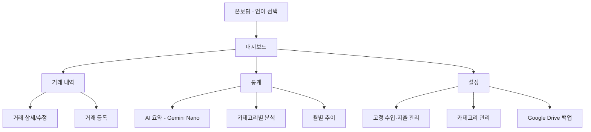

---
tags:
  - UI
  - 화면설계
  - Android
관련:
  - "[[04_기능_요구사항]]"
  - "[[02_시스템_아키텍처]]"
---

# 07. UI 화면 설계

> **최종 업데이트**: 2026-04-17

---

## 🗺️ 화면 구조 (네비게이션)



---

## 📱 화면별 와이어프레임

### 1. 온보딩 화면 (최초 실행)

```
┌─────────────────────────────┐
│                              │
│         💰                   │
│       MoneyLog               │
│                              │
│    언어를 선택하세요          │
│                              │
│  ┌─────────────────────────┐ │
│  │  🇰🇷  한국어             │ │
│  └─────────────────────────┘ │
│  ┌─────────────────────────┐ │
│  │  🇺🇸  English            │ │
│  └─────────────────────────┘ │
│  ┌─────────────────────────┐ │
│  │  🇯🇵  日本語             │ │
│  └─────────────────────────┘ │
│                              │
│  [     시작하기     ]        │
│                              │
└─────────────────────────────┘
```

> 최초 실행 시만 표시. 이후 설정에서 언어 변경 가능 (LocaleHelper, locales_config.xml)

---

### 2. 대시보드 — 메인 화면

```
┌─────────────────────────────┐
│ 💰 MoneyLog     2026년 4월  │
│   ← 이전달       다음달 →   │
├─────────────────────────────┤
│ ┌─────────────────────────┐ │
│ │ 수입     3,500,000원    │ │
│ │ 지출       820,000원    │ │
│ │ 잔액     2,680,000원    │ │
│ └─────────────────────────┘ │
├─────────────────────────────┤
│ ⏰ 자동 등록됨: 3건          │
│ ─────────────────────────── │
│ 💰 4월 급여   +3,500,000원  │
│ 🏠 월세        -500,000원   │
│ 🎮 넷플릭스    -17,000원    │
│          [확인]              │
├─────────────────────────────┤
│ 🤖 AI 한줄 요약              │
│ "식비와 카페 지출이 전월 대비 │
│  15% 증가했습니다"           │
│        [ 상세 보기 → ]      │
├─────────────────────────────┤
│ 📊 카테고리별 지출           │
│ ┌───────────┐               │
│ │  도넛차트  │  식비  45%   │
│ │           │  교통  15%   │
│ │           │  카페  12%   │
│ └───────────┘  기타  28%   │
├─────────────────────────────┤
│ 📋 최근 거래                 │
│ ─────────────────────────── │
│ 🍚 점심 김치찌개  -12,000원  │
│ ☕ 스타벅스       -5,500원   │
│ 🚌 지하철        -1,500원   │
│                             │
│        [전체 보기 →]        │
├─────────────────────────────┤
│  🏠    📋    ➕    📊    ⚙️  │
│  홈   내역  등록  통계  설정  │
└─────────────────────────────┘
```

> 자동 등록 알림: 앱 실행 시 반복 거래가 자동 처리되면 대시보드 상단에 표시
> AI 한줄 요약: Gemini Nano 지원 기기에서만 표시

---

### 3. 거래 등록

```
┌─────────────────────────────┐
│ ← 거래 등록                  │
├─────────────────────────────┤
│                              │
│  [  지출  |  수입  ]  탭     │
│                              │
│  금액                        │
│  ┌─────────────────────────┐ │
│  │           12,000    원  │ │
│  └─────────────────────────┘ │
│                              │
│  날짜                        │
│  ┌─────────────────────────┐ │
│  │ 2026-04-13              │ │
│  └─────────────────────────┘ │
│                              │
│  카테고리                    │
│  🍚식비  🚌교통  ☕카페      │
│  🎮여가  👕의류  📦기타      │
│  🤖 AI 추천: 카페/간식       │
│                              │
│  결제 수단                   │
│  [카드] [현금] [이체] [기타] │
│                              │
│  메모                        │
│  ┌─────────────────────────┐ │
│  │ 스타벅스 아이스아메리카노  │ │
│  └─────────────────────────┘ │
│                              │
│  [        저장하기        ]  │
└─────────────────────────────┘
```

> `🤖 AI 추천`: 메모 입력 시 Gemini Nano가 카테고리를 자동 추천 (지원 기기만)

---

### 4. 거래 내역

```
┌─────────────────────────────┐
│ 📋 거래 내역    🔍 검색      │
│   2026년 4월                 │
├─────────────────────────────┤
│ ▸ 필터: 전체 | 지출 | 수입   │
│         카테고리 ▼           │
├─────────────────────────────┤
│                              │
│ ── 4월 13일 (일) ────────── │
│ 🍚 점심 김치찌개   -12,000원 │
│    카드 | 식비                │
│ ☕ 스타벅스 아아    -5,500원  │
│    카드 | 카페                │
│                              │
│ ── 4월 12일 (토) ────────── │
│ 🚌 지하철          -1,500원  │
│    카드 | 교통                │
│ 🎮 넷플릭스 ⏰    -17,000원  │
│    카드 | 문화/여가   [자동]  │
│                              │
│ ── 4월 1일 (화) ─────────── │
│ 💰 4월 급여 ⏰ +3,500,000원  │
│    이체 | 급여       [자동]   │
│                              │
├─────────────────────────────┤
│  🏠    📋    ➕    📊    ⚙️  │
└─────────────────────────────┘
```

> `⏰ [자동]` 배지: 반복 거래로 자동 등록된 항목 표시

---

### 5. 고정 수입·지출 관리

```
┌─────────────────────────────┐
│ ← ⏰ 고정 수입·지출          │
├─────────────────────────────┤
│                              │
│ 📤 고정 지출                 │
│ ─────────────────────────── │
│ 🏠 월세        500,000원    │
│    매월 25일  ✅ 활성        │
│ 🎮 넷플릭스    17,000원     │
│    매월 15일  ✅ 활성        │
│ 📱 핸드폰      65,000원     │
│    매월 20일  ✅ 활성        │
│                              │
│ 📥 고정 수입                 │
│ ─────────────────────────── │
│ 💰 월급     3,500,000원     │
│    매월 1일  ✅ 활성         │
│ 💵 부수입     200,000원     │
│    매월 10일 ⏸️ 비활성       │
│                              │
│  [  + 고정 거래 추가  ]     │
│                              │
├─────────────────────────────┤
│  🏠    📋    ➕    📊    ⚙️  │
└─────────────────────────────┘
```

---

### 6. 통계 + AI 요약

```
┌─────────────────────────────┐
│ 📊 통계          2026년 4월  │
├─────────────────────────────┤
│                              │
│ 🤖 AI 소비 분석              │
│ ┌─────────────────────────┐ │
│ │ "4월 총 지출 82만원 중   │ │
│ │  식비가 45%로 가장 큰    │ │
│ │  비중입니다. 전월 대비   │ │
│ │  카페 지출이 30% 증가.   │ │
│ │  커피를 주 3회로 줄이면  │ │
│ │  월 2만원 절약 가능."    │ │
│ └─────────────────────────┘ │
│  [🔄 다시 분석]              │
│                              │
│ 월별 지출 추이 (최근 6개월)  │
│ ┌─────────────────────────┐ │
│ │     ╱╲                  │ │
│ │    ╱  ╲   ╱╲            │ │
│ │ ──╱────╲─╱──╲──         │ │
│ │  11  12  1  2  3  4     │ │
│ └─────────────────────────┘ │
│                              │
│ 카테고리별 지출              │
│ ┌─────────────────────────┐ │
│ │ 식비     ████████ 45%   │ │
│ │ 교통     ████     15%   │ │
│ │ 카페     ███      12%   │ │
│ │ 문화     ███      10%   │ │
│ │ 의류     ██        8%   │ │
│ │ 기타     ██       10%   │ │
│ └─────────────────────────┘ │
│                              │
│ 전월 대비                    │
│ 총지출  820,000원  ▲ 5.2%   │
│ 식비    370,000원  ▼ 3.1%   │
│ 교통    123,000원  ▲12.0%   │
│                              │
├──────── 광고 배너 (추후) ────┤
│  🏠    📋    ➕    📊    ⚙️  │
└─────────────────────────────┘
```

> AI 소비 분석 카드: Gemini Nano 지원 기기에서만 표시
> 미지원 기기에서는 수치 기반 통계만 표시

---

### 7. 카테고리 관리

```
┌─────────────────────────────┐
│ ← 📁 카테고리 관리           │
├─────────────────────────────┤
│  [  지출  |  수입  ]  탭    │
├─────────────────────────────┤
│                              │
│ 📤 지출 카테고리             │
│ ─────────────────────────── │
│ 🍚 식비          ≡  ✏️  🗑  │
│ 🚌 교통          ≡  ✏️  🗑  │
│ 🏠 주거/통신     ≡  ✏️  🗑  │
│ ☕ 카페/간식      ≡  ✏️  🗑  │
│                              │
│  [  + 카테고리 추가  ]      │
│                              │
├─────────────────────────────┤
│  🏠    📋    ➕    📊    ⚙️  │
└─────────────────────────────┘
```

> ≡ 아이콘: 드래그 앤 드롭 순서 변경 | ✏️: 수정 | 🗑: 삭제

---

### 8. 설정

```
┌─────────────────────────────┐
│ ⚙️ 설정                      │
├─────────────────────────────┤
│                              │
│ 🌐 언어                      │
│ ─────────────────────────── │
│ 언어 선택     [한국어 ▼]     │
│                              │
│ 📂 데이터 관리               │
│ ─────────────────────────── │
│ ⏰ 고정 수입·지출 관리    →  │
│ 📁 카테고리 관리          →  │
│                              │
│ ☁️ 백업 & 복원               │
│ ─────────────────────────── │
│ Google Drive 백업 & 복원  →  │
│ (미연동: "Google Drive 연동")│
│ (연동됨: 이메일 주소 표시)   │
│ → 클릭 시 백업/복원/해제 선택│
│                              │
│ 📤 내보내기                  │
│ ─────────────────────────── │
│ CSV 파일 공유             →  │
│                              │
│ 🤖 AI 기능                   │
│ ─────────────────────────── │
│ Gemini Nano 상태  [지원됨]   │
│                              │
│ 💰 표시 설정                 │
│ ─────────────────────────── │
│ 금액 텍스트 모드  [OFF]      │
│ (ON 시: "약 1억" 형태로 표시)│
│                              │
│ ⚠️ 위험 영역                 │
│ ─────────────────────────── │
│ [ 전체 데이터 초기화 ]       │
│                              │
├─────────────────────────────┤
│  🏠    📋    ➕    📊    ⚙️  │
└─────────────────────────────┘
```

---

## 🎨 디자인 가이드

### 색상 팔레트

| 용도 | 색상 | HEX |
|---|---|---|
| Primary | 인디고 블루 | `#4F46E5` |
| Success / 수입 | 그린 | `#10B981` |
| Danger / 지출 | 레드 | `#EF4444` |
| Warning / 초과 | 앰버 | `#F59E0B` |
| Auto / 자동 | 퍼플 | `#8B5CF6` |
| AI / Gemini | 시안 | `#06B6D4` |
| Background | 라이트 그레이 | `#F9FAFB` |
| Text | 다크 그레이 | `#111827` |

### 타이포그래피

| 용도 | 폰트 | 크기 |
|---|---|---|
| 금액 (큰) | Pretendard Bold | 28sp |
| 금액 (목록) | Pretendard SemiBold | 16sp |
| 본문 | Pretendard Regular | 14sp |
| 캡션 | Pretendard Regular | 12sp |

### Material 3 컴포넌트

| 용도 | 컴포넌트 |
|---|---|
| 네비게이션 | `NavigationBar` (하단 5탭) |
| 카드 | `MaterialCardView` (24dp round) |
| 버튼 | `FilledButton`, `OutlinedButton`, `FAB` |
| 입력 | `TextInputLayout` (Plinth 스타일) |
| 차트 | MPAndroidChart 3.1.0 (`PieChart` 도넛) |
| 다이얼로그 | `MaterialAlertDialogBuilder` (28dp round) |
| 스낵바 | `Snackbar` (자동 등록 알림 등) |
| 스크롤 UX | 글로벌 스크롤 탑 FAB (`activity_main.xml`), 헤더 숨김 |

### 광고 배너 영역 (추후)

| 위치 | 크기 | 표시 조건 |
|---|---|---|
| Bottom Nav 바로 위 | 320x50 | `AD_ENABLED=true` 일 때만 (AdMob) |
| 통계 페이지 진입 | 전면 (인터스티셜) | 선택적 |

---

## 🔗 연관 문서

- [[04_기능_요구사항]] — 기능 명세
- [[06_데이터_레이어_설계]] — 데이터 레이어
- [[03_기술_스택]] — UI 라이브러리

### 스택: #UI #와이어프레임 #디자인 #Material3 #GeminiNano
